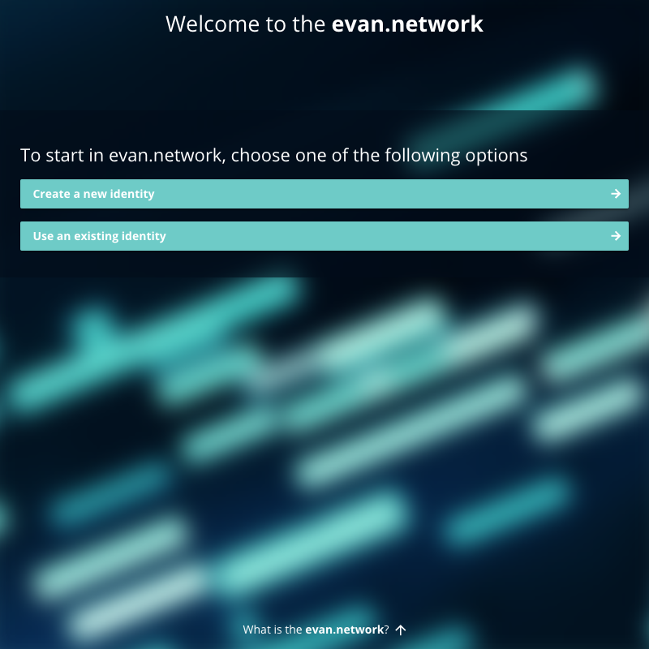
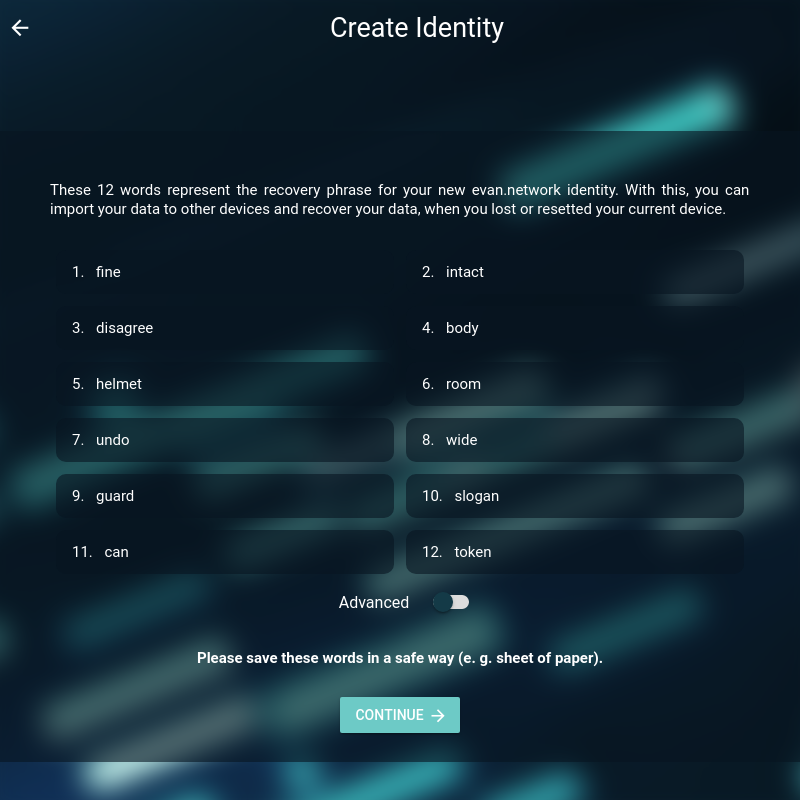
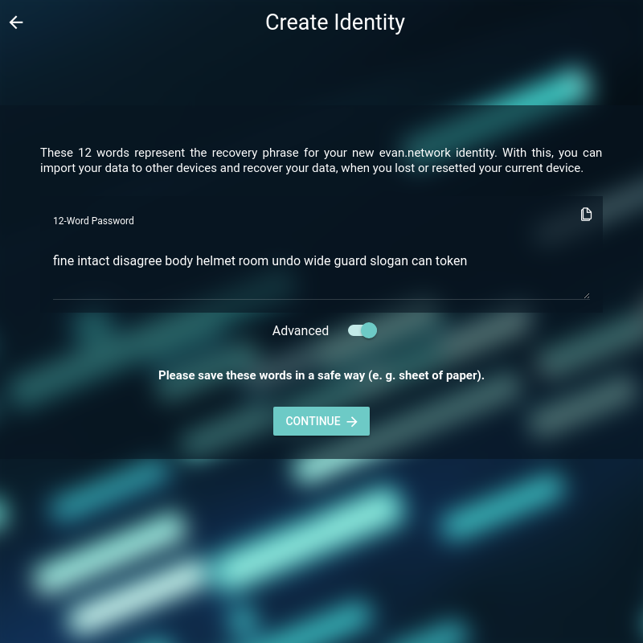
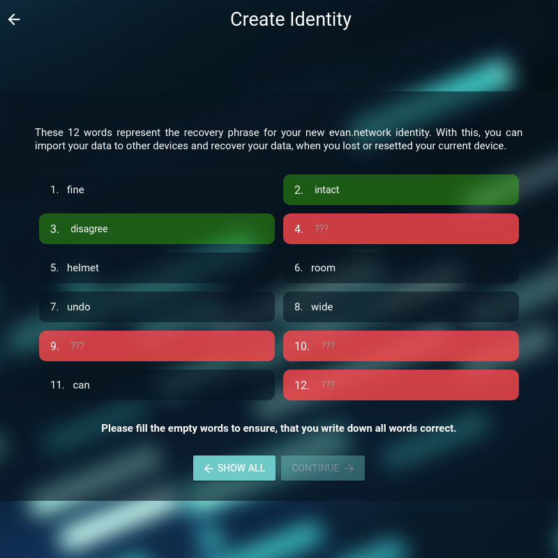
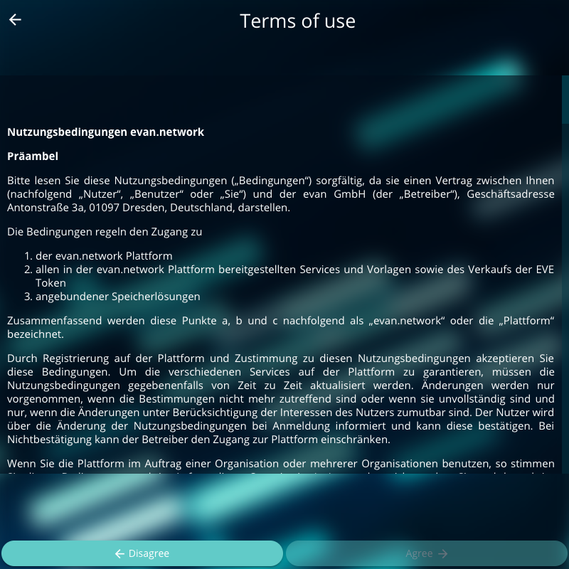
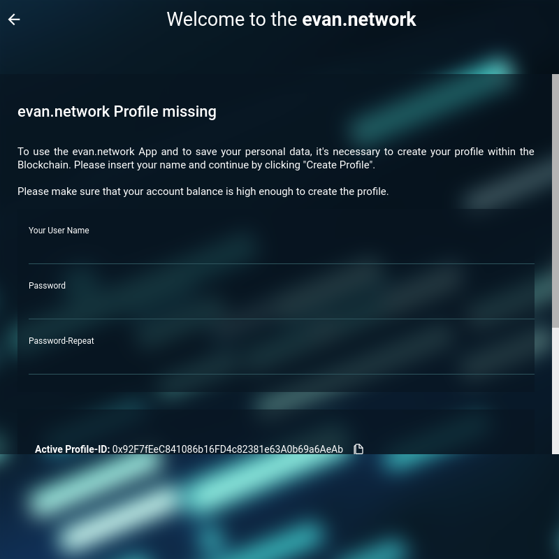
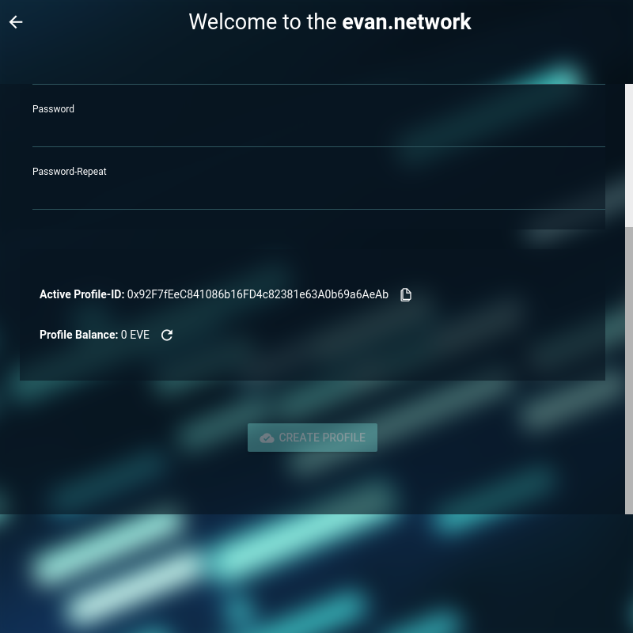
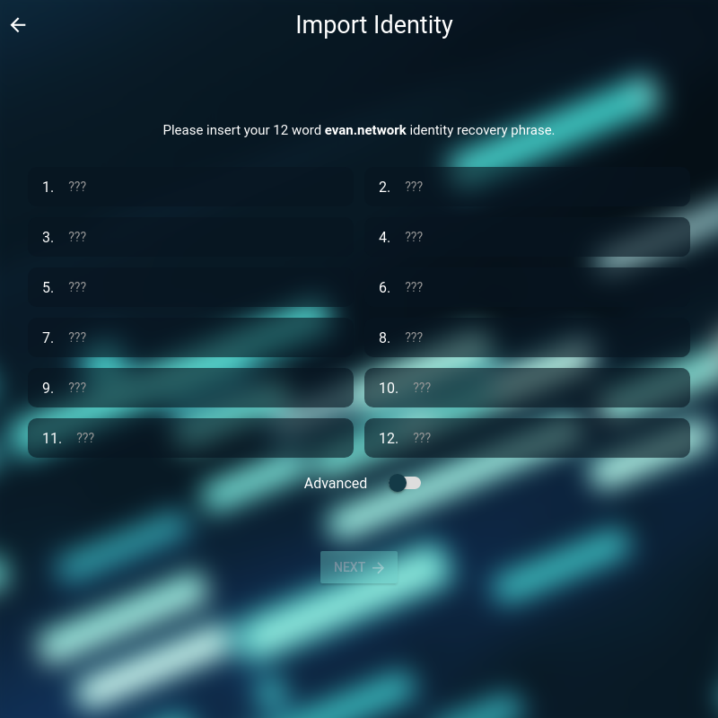
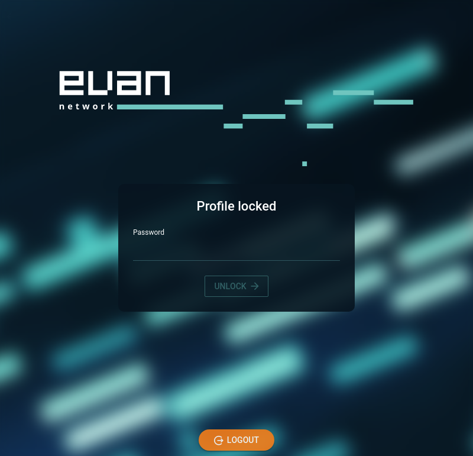

# Create Identity

To work with ÐAPPs in the evan.network, you need a profile. The identity (or "profile") is similar to a personal organizer and holds your data, e.g.:
- contacts you know
- encryption keys exchanged with contacts
- an own public key for exchanging keys with new contacts
- bookmarked ÐAPPs
- created contracts

Go to [https://dashboard.evan.network](https://dashboard.evan.network) and get started.

You have 2 options:

[{:width="50%"}](./img/onboarding_start.png)

## A New Identity

If you do not have an account, you can create a new one with "A New Identity".

After accepting the terms of use, you will be shown the 12 words recovery phrase.

[{:width="50%"}](./img/onboarding_new.png)

With these 12 words you will be able to import your account on another device or recover your identity on the current device. **Keep these words in a secure location** by writing them down on a sheet of paper that is stored in a safe location, or by saving the words in a password manager or a similar application. After generating the profile, these 12 words won't be stored by evan.network applications, neither on-chain nor off-chain. Only the resulting account information is stored and only in an encrypted way on the current device. So recovering those 12 words is not possible if lost.

If you want to copy the words to a password manager, you can do this on the advanced page, which can be reached via the toggle option below the recovery phrase words.

[{:width="50%"}](./img/onboarding_advanced.png)

When continuing you will be prompted to verify the recovery phrase by showing the same phrase with some words missing. You have to fill the sections with the missing words to continue.

[{:width="50%"}](./img/onboarding_quiz.png)

After this the terms of use are shown. Read these carefully and if you consent to the conditions, confirm that you aren't are robot and click on "Agree". Of course robots are welcome on evan.network, but we recommend them to use [Smart Agents](/docs/02_how_it_works/smart-agents.html). ;)

[{:width="50%"}](./img/onboarding_termsofuse.png)

Then you can enter an alias for you account and enter a password. This password is used to secure your account data on the current device and for encrypting you data on the blockchain. So use a secure password and store it in a safe location.

[{:width="50%"}](./img/onboarding_final1.png)

The section below shows your evan.network account ID and your current balance. If your balance is too low, you won't be able to create a new profile and the button is disabled.

To get EVEs in the testcore chain, use the faucet described [here](/docs/04_developers/cheatsheet.html#q-how-do-i-get-more-development-funds).

[{:width="50%"}](./img/onboarding_final2.png)

Once your balance is sufficient, you can continue by creating and storing your profile in the blockchain. When this is done, you are finally onboarded and will be able to see the [dashboard](/docs/03_first_steps/dashboard.html).

# Import Identity
When you already have an account and want to import it on a device, use "An Existing Identity".

[{:width="50%"}](./img/onboarding_import_quiz.png)

After entering the recovery phrase, enter your password on the lock screen and continue to work with evan.network.

[{:width="50%"}](./img/onboarding_locked.png)
