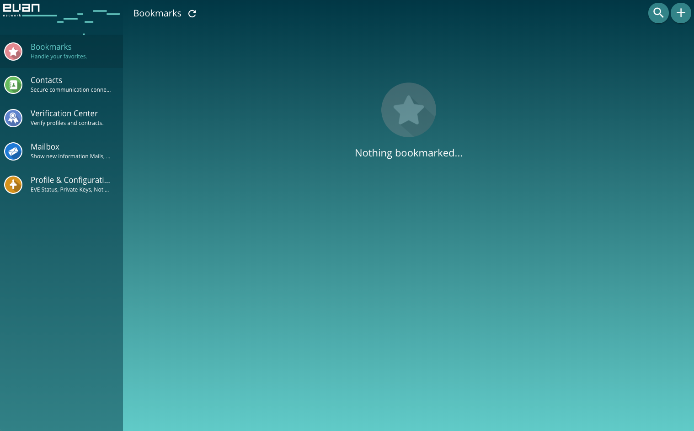
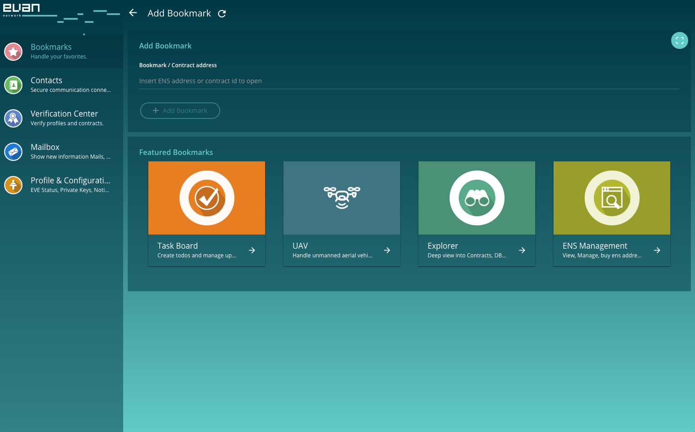

# Dashboard
The dashboard ÐAPP is your main entry point when logging in to evan.network.

Upon your first login, there isn't much to see just yet. 

Clicking on "Profiles & Configuration" will provide you with an overview about your current EVE balance and allow you to copy your private key and your profile encryption key. 

[{:width="50%"}](./img/profile.png)

Depending on how you were invited, you will have different starting balances.

The private key is used to secure access to your blockchain identity. This key can be thought of as your 'blockchain fingerprint'.

With the profile encryption key, all your profile data is encrypted. Mails, smart contracts and communication with your contacts are encrypted with your profile encryption key.

When clicking on "Bookmarks" you can use or manage your bookmarked ÐAPPs. When adding bookmarks, you can add ENS addresses, contract addresses or select featured ÐAPPs. Added bookmarks are stored in your profile.

[{:width="50%"}](./img/dashboard.png)

Personal bookmarks can be created with "Add Bookmark". This allows easier access to tools like the Evan.network explorer and ENS or smart contracts. 

[{:width="50%"}](./img/dashboard_add_bookmark.png)