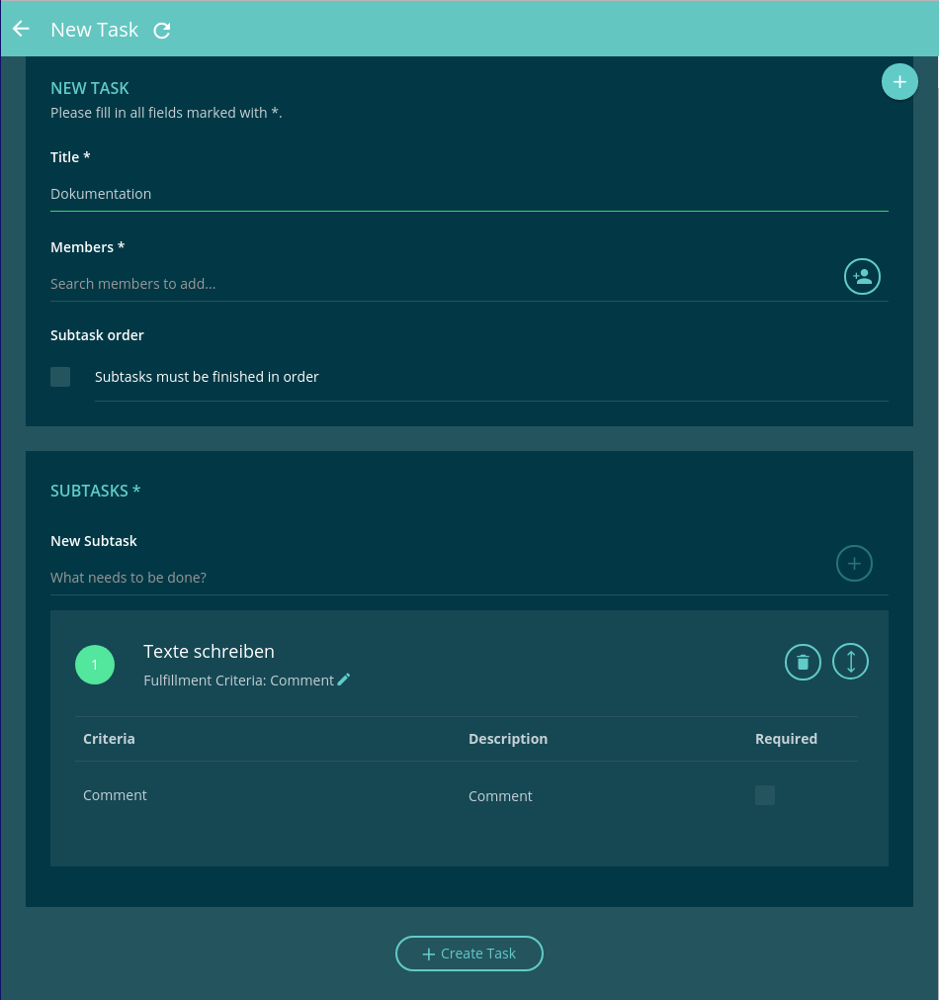
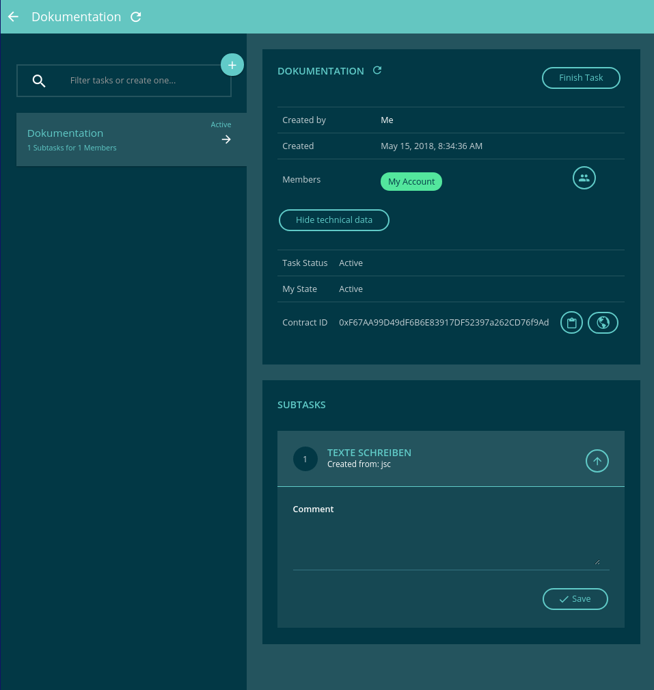

# Taskboard
The taskboard helps you to create tasks that need to be worked on. You can either use it to organize yourself, or create and assign tasks to others.

## A Subtask

You have to add a subtask, even if there is only one point to do for your whole task.

[{:width="50%"}](./img/create_task.png)

It can take a few seconds once you submit the form, because a task is stored in the blockchain of course, and creating one is a transaction that needs to be mined.

When it is finished, you can see the new task in your task overview, just the headline though.

As tasks accumulate over time, you will appreciate the search and filter functionality.

Click on your newly created task and start it to begin working. Once you have started it, everyone can
see that it is in progress, and you can add comments or even new members.

## [You need Contacts](/docs/03_first_steps/contacts)

A task manager just for yourself is all nice and well, but that is something that can be done in a text file. The point of a real task management application is to coordinate with others.

And here comes the advantage of the blockchain into the game: you can add anyone who joined evan.network.
Even if they didn't open the Taskboard or even know of its existence. They may have joined evan.network for completely different reasons and use completely different [Ðapps](/docs/04_developers/basics.html), but if you have established a contact with them, you can reference them in your applications and work. It is all interconnected through the common dataset of the blockchain.

You can add new members by clicking on the people icon.

[{:width="50%"}](./img/edit_task.png)

## Finish the Task

Let's assume you have done all your work and want to finish, so add a comment in the subtask.

When you have saved it, a "Finish Work" button appears, and if you click that you complete the subtask.

Since this was the only subtask in the whole ticket, you might as well finish it all,
by clicking on the "Finish Task"  button on the top right.
