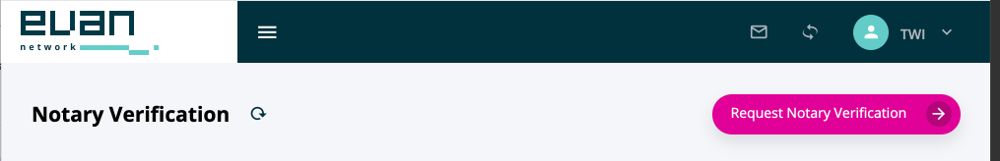
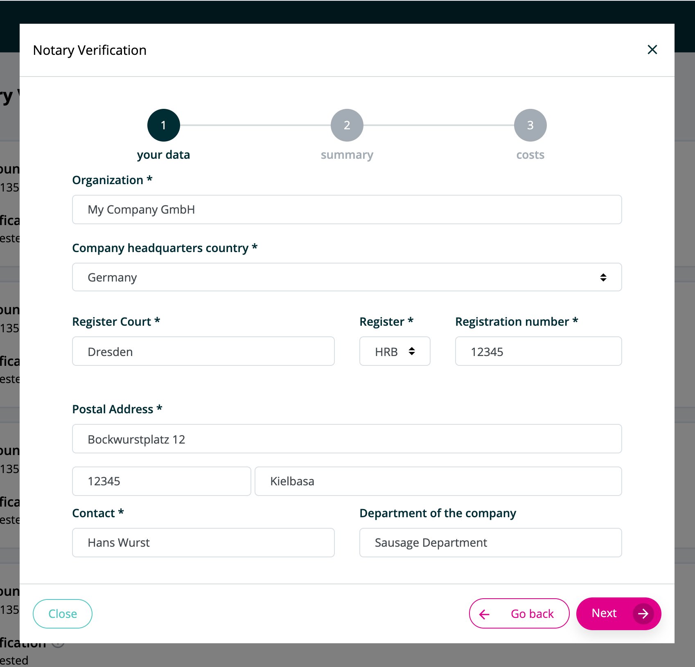
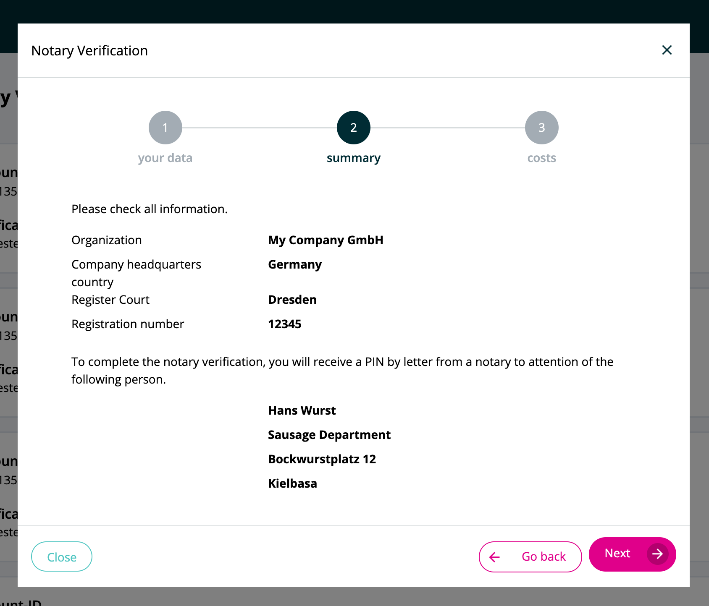
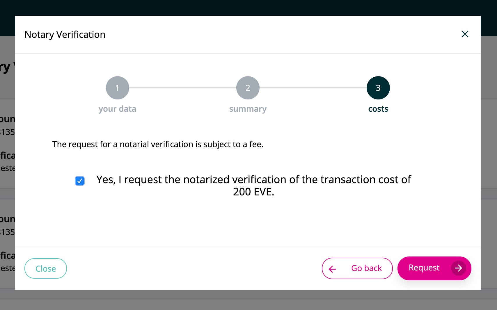
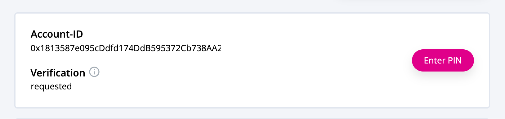
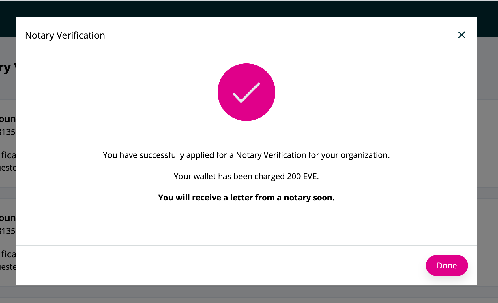
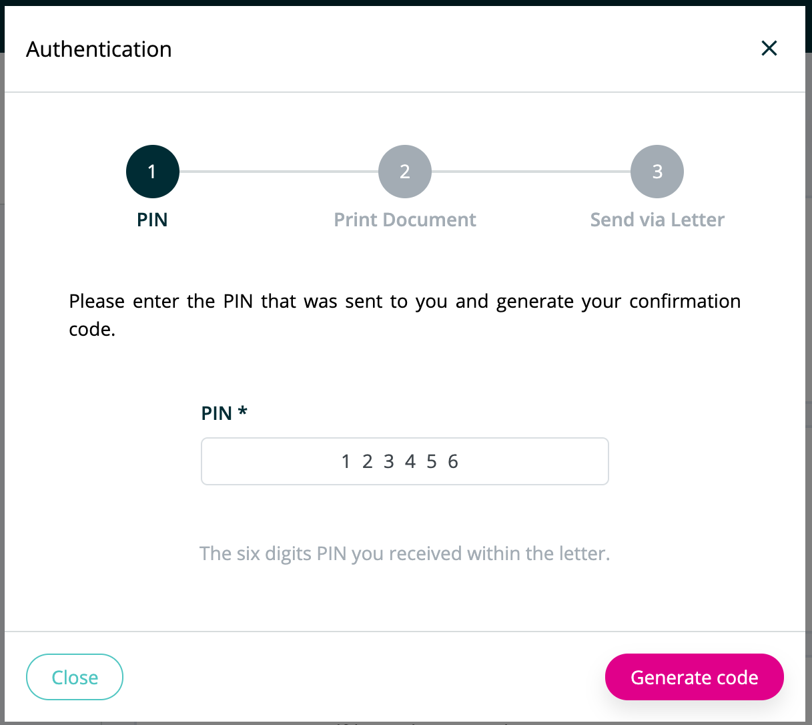

# Notary Verification

## Purpose

A verified account assures people and companies know that your evan.network account belongs to a registered company.

This is approved by a notary and assured by cryprographic algorithms which can not be manipulated.

## Advantages

The notarial verification confirms that your company has a certain account ID.
With this confirmation you can prove yourself to your business partners and verify that transactions, digital twins and smart contracts originate from you.

This is approved by a notary and assured by cryprographic algorithms which can not be manipulated.

## How to get verified

To get your organization verified, you need to prove that the account belongs to your company as described in the following steps.

### Prerequisites
Currently only in germany registered companies are able to request a notarial verification. The company needs to be registered with the german 'Handelsregister'.

## Steps
Request the notary verification, in your [userprofile](https://dashboard.evan.network/#/dashboard.vue.evan/profile.vue.evan/organizations.evan) under the 'organizations' tab click on your organization and then on <button>Request Notary Verification</button>

[{:width="50%"}](../img/notary_verification_step1.png)

- 1st step: The following information is needed

  - The commercial register number
  - The register court where your company is registered
  - The address of your company - if you have multiple branches the address of the main branch
  - contact person, an authorized representative of your company

[{:width="33%"}](../img/notary_verification_step2.png)
[{:width="33%"}](../img/notary_verification_step3.png)
[{:width="33%"}](../img/notary_verification_step4.png)

- 2nd Step: Authenticate
  - You will receive a PIN by letter, which will be sent as a personal letter to the named contact person.
  - Use the six digit PIN to generate the confirmation document in your evan account.
  - Print and sign the generated document and sent it back to the inquiring notary.

[{:width="33%"}](../img/notary_verification_step5.png)
[{:width="33%"}](../img/notary_verification_step6.png)
[{:width="33%"}](../img/notary_verification_ste7.png)

- 3rd Step: Accept
  - As soon as the verification is successful, you will be notified via b-Mail in your evan account.
  - Accept the verification as the last step.

## Costs
The transaction costs for notarial verification are **200 EVE**. Your wallet will be debited with this amount.
