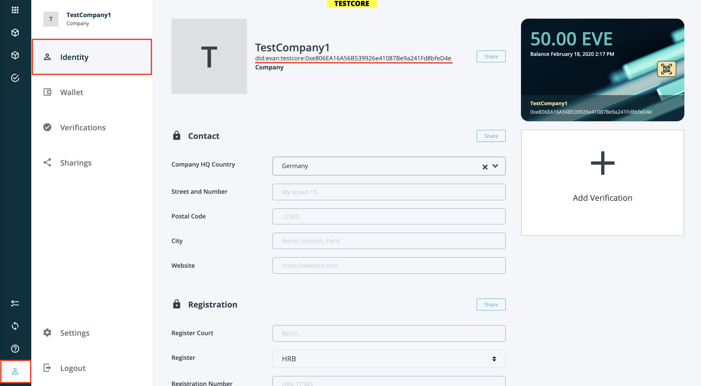

# Decentralized Identifiers (DIDs)
A decentralized identifier, or DID, is a means to claim and manage an identity that is verifiable, decentralized, and independent.
The owner of the identity is the only one who can proof ownership over and make changes to this identity.
The DID itself is only a reference pointing to a DID document containing the information necessary for authentication.
DIDs are very useful in combination with [Verifiable Credentials](./4170_VC.md) to make and validate claims, e.g. certifications of ownership or usage authorization.
For an in-depth explanation of DIDs, please refer to the [W3C DID working draft](https://w3c.github.io/did-core).

## DIDs in evan.network

Every identity in evan.network has an according DID that is generated and assigned automatically upon identity creation. This DID points to the according DID document. Every identity gets assigned a default DID document upon creation. This document can be edited by the owner and the controller of the identity at any time.  
To retrieve the DID of your identity programatically, you can use the [respective API method](https://api-blockchain-core.readthedocs.io/en/latest/profile/did.html#convertidentitytodid).  
In the UI you can find your DID in the [profile view](https://dashboard.test.evan.network/#/dashboard.vue.evan/profile.vue.evan/):



The DID always has the format `did:evan:<network>:<id>` where the network can be `core` or `testcore`. DIDs from `core` network can also be referenced with the format `did:evan:<id>`, as DIDs without a network identifier always refer to DIDs on `core`. The id is either a 20-character for *self-sovereign identities* or a 32-character address for *asset identities*.

An example address for a self-sovereign identity looks like the following:
```
did:evan:testcore:0x126E901F6F408f5E260d95c62E7c73D9B60fd734
```
For more details about evan.network DID addresses, please refer to the [evan DID method specification](https://github.com/evannetwork/evan.network-DID-method-specification/blob/master/evan_did_method_spec.md).

### Resolving DIDs
evan.network offers a DID resolver service for both on-chain and off-chain use cases.

For on-chain use cases you can query the [respective API methods](https://api-blockchain-core.readthedocs.io/en/latest/profile/did.html).

For off-chain use cases evan.network provides a REST service at
```
https://testcore.evan.network/did/{did}
```
which resolves a valid DID to the according DID document.
[Try it yourself here.](https://testcore.evan.network/did/did:evan:testcore:0x126E901F6F408f5E260d95c62E7c73D9B60fd734)  
evan.network also provides a very lean [node package](https://www.npmjs.com/package/@evan.network/did-resolver) to consume the REST service.

In case you want to implement your own resolver service, please refer to the [evan DID method specification](https://github.com/evannetwork/evan.network-DID-method-specification/blob/master/evan_did_method_spec.md).

### Universal Resolver
evan.network DIDs are also supported by universal resolver which is hosted by the decentralized identity foundation. The universal resolver aims to resolves DIDs from multiple blockchains. The following DID is an example from evan.network which can be resolved using the universal resolver. Please click [here](https://uniresolver.io/) to access the resolver, paste the DID in the did-url and click resolve. Give it a try! :)
```
did:evan:testcore:0x96dA854df34f5dcD25793B75e170B3d8c63A95Ad
```
The resolver will return a DID document linked to the given DID.

### Updating DID Documents
DIDs and DID documents are generated and assigned to evan.network identities upon creation.
To apply changes you can use the [evan.network API](https://github.com/evannetwork/api-blockchain-core).
You must be either the owner or the controller of the identity to apply modifications.

Allowed updates include
- changing the identity's controller
- adding and removing delegates
- adding and removing service endpoints that are to be associated with your DID

The `controller` and `authentication` properties also allow to map evan.network's rights & roles model to DIDs.

[{:class="center"}](/docs/4000_developers/4100_concepts/img/did_concept.png)


### evan.network Identity Types
Identities in evan.network can vary in their type.
Each type implies a different DID format and different features.
The following section describes each type, their attributes, and their individual differences.

**Self-sovereign Identity (SSI)**<br>
Self-sovereign identities (SSIs) can either be a company, a device, or a user. These identities are created, owned, and managed by a person via an externally owned account/private key and have their own means of authentication and signing and can issue verified credentials. Changes to the DID document itself can only be performed by the owner or another SSI referenced via the `controller` property of the DID document. SSIs fully feature key revocation and key rotation. 
An SSI's DID document contains a signature created with the owner's key (see `proof` property) that can be used to verify the integrity of the DID.

The following sample shows an SSI's DID document. The SSI provides their own means of authentication by providing a public key.
```js
{
    "@context": "https://w3id.org/did/v1",
    "id": "did:evan:testcore:0x96dA854df34f5dcD25793B75e170B3d8c63A95Ad",
    "publicKey": [
      {
        "id": "did:evan:testcore:0x96dA854df34f5dcD25793B75e170B3d8c63A95Ad#key-1",
        "type": "Secp256k1VerificationKey2018",
        "controller": "did:evan:testcore:0x96dA854df34f5dcD25793B75e170B3d8c63A95Ad",
        "ethereumAddress": "0x001De828935e8c7e4cb56Fe610495cAe63fb2612"
      }
    ],
    "authentication": [
      "did:evan:testcore:0x96dA854df34f5dcD25793B75e170B3d8c63A95Ad#key-1"
    ],
    "created": "2020-02-13T10:56:39.740Z",
    "updated": "2020-02-13T10:56:39.740Z",
    "proof": {
      "type": "EcdsaPublicKeySecp256k1",
      "created": "2020-02-13T10:56:39.743Z",
      "proofPurpose": "assertionMethod",
      "verificationMethod": "did:evan:testcore:0x96dA854df34f5dcD25793B75e170B3d8c63A95Ad#key-1",
      "jws": "eyJ0eXAiOiJKV1QiLCJhbGciOiJFUzI1NkstUiJ9.eyJpYXQiOjE1ODE1OTEzOTksImRpZERvY3VtZW50Ijp7IkBjb250ZXh0IjoiaHR0cHM6Ly93M2lkLm9yZy9kaWQvdjEiLCJpZCI6ImRpZDpldmFuOnRlc3Rjb3JlOjB4OTZkQTg1NGRmMzRmNWRjRDI1NzkzQjc1ZTE3MEIzZDhjNjNBOTVBZCIsInB1YmxpY0tleSI6W3siaWQiOiJkaWQ6ZXZhbjp0ZXN0Y29yZToweDk2ZEE4NTRkZjM0ZjVkY0QyNTc5M0I3NWUxNzBCM2Q4YzYzQTk1QWQja2V5LTEiLCJ0eXBlIjoiU2VjcDI1NmsxU2lnbmF0dXJlVmVyaWZpY2F0aW9uS2V5MjAxOCIsInB1YmxpY0tleUhleCI6IjA0NWFkZmQ1MDJjMGJjNTVmNGZjYjkwZWVhMzYzNjhkN2UxOWM1YjMwNDVhYTZmNTFkZmEzNjk5MDQ2ZTk3NTEyNTFkMjFiYzZiZGQwNmMxZmYwMDE0ZmNiYmY5ZjFkODNjNzE0NDM0ZjJiMzNkNzEzYWFmNDY3NjBmMmQ1M2YxMGQifV0sImF1dGhlbnRpY2F0aW9uIjpbImRpZDpldmFuOnRlc3Rjb3JlOjB4OTZkQTg1NGRmMzRmNWRjRDI1NzkzQjc1ZTE3MEIzZDhjNjNBOTVBZCNrZXktMSJdLCJjcmVhdGVkIjoiMjAyMC0wMi0xM1QxMDo1NjozOS43NDBaIiwidXBkYXRlZCI6IjIwMjAtMDItMTNUMTA6NTY6MzkuNzQwWiJ9LCJpc3MiOiJkaWQ6ZXZhbjp0ZXN0Y29yZToweDk2ZEE4NTRkZjM0ZjVkY0QyNTc5M0I3NWUxNzBCM2Q4YzYzQTk1QWQifQ.yHcdjbhXQl9jc0p5tAcUvfQ7EXYp6aovgkd44LEuARzML_4oRTxtpCSiNlJdM4e5Zh8tFyvqdjP_4jAFQtW2pgA"
    }
  }
```

For identities that have never executed any transactions, yet, their default DID document looks like the following.
```js
{
    "@context": "https://w3id.org/did/v1",
    "id": "did:evan:testcore:0x126E901F6F408f5E260d95c62E7c73D9B60fd734",
    "publicKey": [
      {
        "id": "did:evan:testcore:0x126E901F6F408f5E260d95c62E7c73D9B60fd734#key-1",
        "type": "Secp256k1VerificationKey2018",
        "controller": "did:evan:testcore:0x126E901F6F408f5E260d95c62E7c73D9B60fd734",
        "ethereumAddress": "0x126E901F6F408f5E260d95c62E7c73D9B60fd734"
      }
    ],
    "authentication": [
      "did:evan:testcore:0x126E901F6F408f5E260d95c62E7c73D9B60fd734#key-1"
    ]
}
```

**Asset Identity**<br>
Asset identities, digital twins, or simply assets, are created and owned by an SSI and have no own means of authentication. 
The owner of the asset is also the `controller` of the DID document and is exclusively allowed to make changes to the it. 
The owner is also registered with the identity via the `authentication` field of the DID document and is thus allowed to authenticate in its name.
An asset identity's `proof` signature is created with one of the controller's keys, referenced in the `proof`'s `verificationMethod` property.

The following sample shows an asset identity's DID document. The asset has no `authentication` means and only points to its owner's SSI which is delegated to authenticate in this asset identity's name, as well as apply changes to the DID document (via the `controller` property).

```js
  {
    "@context": "https://w3id.org/did/v1",
    "id": "did:evan:testcore:0xf796a2c8d870d09807995193ad9fd66fc4c7810245432f3b27ab8ca2ab942a19",
    "controller": "did:evan:testcore:0x96dA854df34f5dcD25793B75e170B3d8c63A95Ad",
    "authentication": [
      "did:evan:testcore:0x96dA854df34f5dcD25793B75e170B3d8c63A95Ad#key-1"
    ],
    "created": "2020-02-13T08:55:51.241Z",
    "updated": "2020-02-13T08:55:51.241Z",
    "proof": {
      "type": "EcdsaPublicKeySecp256k1",
      "created": "2020-02-13T08:55:51.312Z",
      "proofPurpose": "assertionMethod",
      "verificationMethod": "did:evan:testcore:0x96dA854df34f5dcD25793B75e170B3d8c63A95Ad#key-1",
      "jws": "eyJ0eXAiOiJKV1QiLCJhbGciOiJFUzI1NkstUiJ9.eyJpYXQiOjE1ODE1ODQxNTEsImRpZERvY3VtZW50Ijp7IkBjb250ZXh0IjoiaHR0cHM6Ly93M2lkLm9yZy9kaWQvdjEiLCJpZCI6ImRpZDpldmFuOnRlc3Rjb3JlOjB4Zjc5NmEyYzhkODcwZDA5ODA3OTk1MTkzYWQ5ZmQ2NmZjNGM3ODEwMjQ1NDMyZjNiMjdhYjhjYTJhYjk0MmExOSIsImNvbnRyb2xsZXIiOiJkaWQ6ZXZhbjp0ZXN0Y29yZToweDk2ZEE4NTRkZjM0ZjVkY0QyNTc5M0I3NWUxNzBCM2Q4YzYzQTk1QWQiLCJhdXRoZW50aWNhdGlvbiI6WyJkaWQ6ZXZhbjp0ZXN0Y29yZToweDk2ZEE4NTRkZjM0ZjVkY0QyNTc5M0I3NWUxNzBCM2Q4YzYzQTk1QWQja2V5LTEiXSwiY3JlYXRlZCI6IjIwMjAtMDItMTNUMDg6NTU6NTEuMjQxWiIsInVwZGF0ZWQiOiIyMDIwLTAyLTEzVDA4OjU1OjUxLjI0MVoifSwiaXNzIjoiZGlkOmV2YW46dGVzdGNvcmU6MHg5NmRBODU0ZGYzNGY1ZGNEMjU3OTNCNzVlMTcwQjNkOGM2M0E5NUFkIn0.EFU41wA4B6LSyZCoFbPIl3fClSrfGjuANlcR7tUqFpRmyB3-hKsh60BOeq4QxhBzTZr9UoMqMfgWLnnhjweKYgE"
    }
  }
```

**External Reference Identities**<br>
In evan.network you can create skeleton identities that reference external ressources. This allows you to create verifications over ressources or entities outside of the blockchain. These identities can be addressed via their DID just like every other identity and are managed like an SSI.
