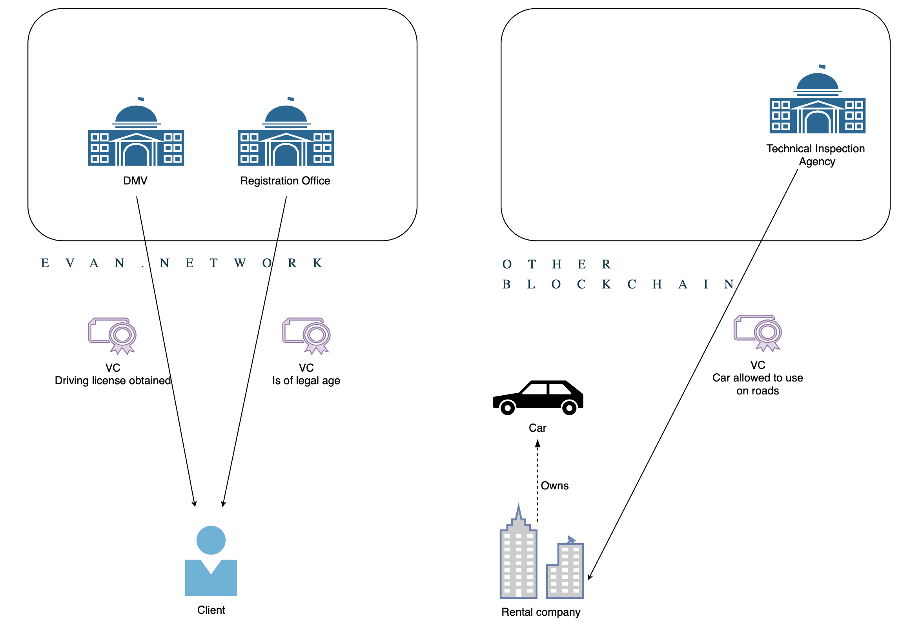
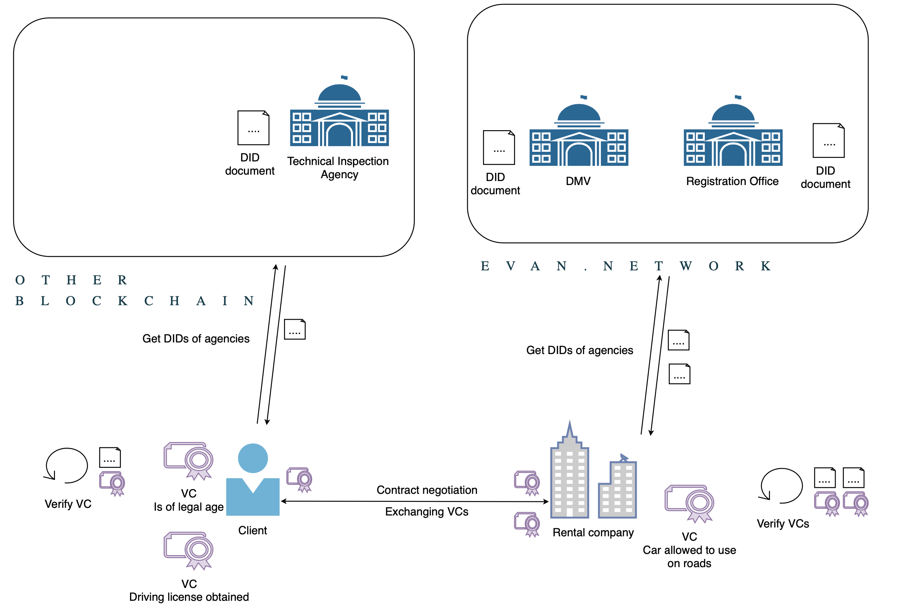
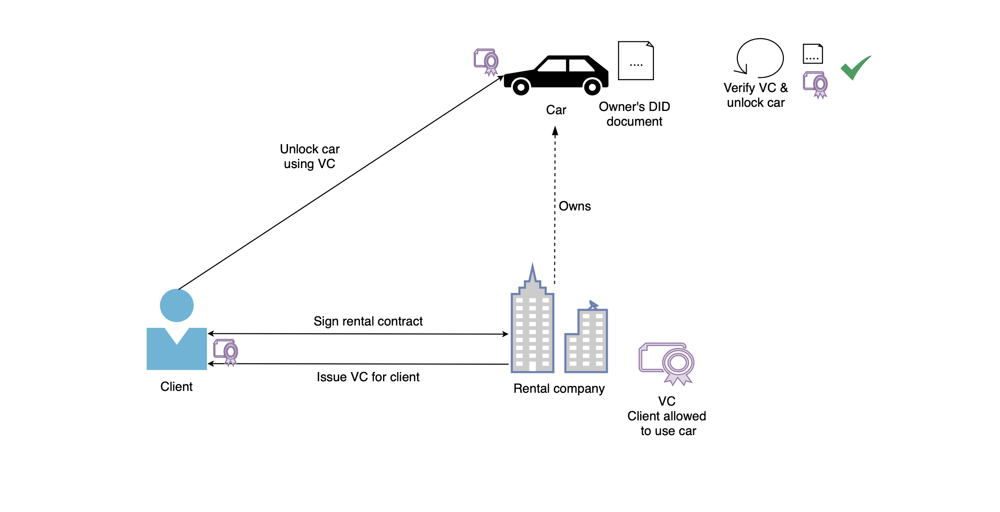

# Verifiable Credentials (VCs)
A [verifiable credential](https://www.w3.org/TR/vc-data-model/), or VC, is a means for an issuer to issue a credential stating a fact about a subject in a cryptographically secure, tamper-proof, and machine-readable and -verifiable way.
In the context of evan.network, VCs allow to use the verification mechanism in a global scope, interoperable with other blockchains.  
The essential parts of a VC are:
- the IDs of both the **issuer** and the **subject**, which are [DIDs](./4160_DID.md), each pointing to a DID document containing cryptographical material used for authentication and verification
- **credential data**, that contains payload that makes up the statement of the credential, and
- a **cryptographical proof**, that ensures
  - the integrity of the VC since the proof becomes invalid as soon as a detail about the VC is changed, and
  - the legitimacy of the VC. Only the issuer of the VC can create a valid proof signature, because only he knows his private key. The proof can easily be verified using the issuer's DID, which holds the related public key.

## Sample VC
A typical VC in evan.network might look like this:
```javascript
{
  "@context": [ "https://www.w3.org/2018/credentials/v1" ],
  "type": [ "VerifiableCredential" ],
  "id": "vc:evan:testcore:0xdb9bb94e124be76a55465f11b3091fe174f691f604d0a63930c90f655ef7c8e2",
  "issuer": {
    "id": "did:evan:testcore:0x390f70a9AD51a845C8ea4c74E141219361D247cf"
  },
  "credentialSubject": {
    "id": "did:evan:testcore:0x59eD4f895fE3757dB5BC39cb3608C69f7C007BeC",
    "data": [
      {
        "name": "isTrustedSupplier",
        "value": "true"
      }
    ]
  },
  "validFrom": "2020-01-06T17:47:02.604Z",
  "credentialStatus": {
    "id": "https://testcore.evan.network/smart-agents/smart-agent-did-resolver/vc/status/vc:evan:testcore:0xdb9bb94e124be76a55465f11b3091fe174f691f604d0a63930c90f655ef7c8e2",
    "type": "evanCredentialStatusService"
  },
  "proof": {
    "type": "EcdsaPublicKeySecp256k1",
    "created": "2020-01-06T17:47:06.526Z",
    "proofPurpose": "assertionMethod",
    "verificationMethod": "did:evan:testcore:0x390f70a9AD51a845C8ea4c74E141219361D247cf#key-1",
    "jws": "eyJ0eXAiOiJKV1QiLCJhbGciOiJFUzI1NkstUiJ9.eyJpYXQiOjE1NzgzMzI4MjYsInZjIjp7IkBjb250ZXh0IjpbImh0dHBzOi8vd3d3LnczLm9yZy8yMDE4L2NyZWRlbnRpYWxzL3YxIl0sInR5cGUiOlsiVmVyaWZpYWJsZUNyZWRlbnRpYWwiXSwiaWQiOiJ2YzpldmFuOnRlc3Rjb3JlOjB4ZGI5YmI5NGUxMjRiZTc2YTU1NDY1ZjExYjMwOTFmZTE3NGY2OTFmNjA0ZDBhNjM5MzBjOTBmNjU1ZWY3YzhlMiIsImlzc3VlciI6eyJpZCI6ImRpZDpldmFuOnRlc3Rjb3JlOjB4MzkwZjcwYTlBRDUxYTg0NUM4ZWE0Yzc0RTE0MTIxOTM2MUQyNDdjZiJ9LCJjcmVkZW50aWFsU3ViamVjdCI6eyJpZCI6ImRpZDpldmFuOnRlc3Rjb3JlOjB4NTllRDRmODk1ZkUzNzU3ZEI1QkMzOWNiMzYwOEM2OWY3QzAwN0JlQyIsImRhdGEiOlt7Im5hbWUiOiJpc1RydXN0ZWRTdXBwbGllciIsInZhbHVlIjoidHJ1ZSJ9XX0sInZhbGlkRnJvbSI6IjIwMjAtMDEtMDZUMTc6NDc6MDIuNjA0WiIsImNyZWRlbnRpYWxTdGF0dXMiOnsiaWQiOiJodHRwczovL3Rlc3Rjb3JlLmV2YW4ubmV0d29yay9zbWFydC1hZ2VudHMvc21hcnQtYWdlbnQtZGlkLXJlc29sdmVyL3ZjL3N0YXR1cy92YzpldmFuOnRlc3Rjb3JlOjB4ZGI5YmI5NGUxMjRiZTc2YTU1NDY1ZjExYjMwOTFmZTE3NGY2OTFmNjA0ZDBhNjM5MzBjOTBmNjU1ZWY3YzhlMiIsInR5cGUiOiJldmFuQ3JlZGVudGlhbFN0YXR1c1NlcnZpY2UifX0sImlzcyI6ImRpZDpldmFuOnRlc3Rjb3JlOjB4MzkwZjcwYTlBRDUxYTg0NUM4ZWE0Yzc0RTE0MTIxOTM2MUQyNDdjZiJ9.BGVdiecPAzvxn3UBETb4ki5Vm2jZasvESewDo7-oCFFIaS1M4eaoVgUlw05lSu5SsMhd-sqOaSx8edLfjnY9KwA"
  }
}
```

Properties of interest:
- `id`
  - The unique identifier. In case of on-chain VCs this is automatically generated and assigned and can be used to query and revoke the VC. For off-chain VCs any string is a valid value.
- `issuer`
  - The identity issuing a credential. Is a DID pointing to a DID document.
- `credentialSubject`
  - `id`
    - The DID of the subject.
  - `data`
    - Contains information about the actual credential. Fully customizable.
  - `description` (optional)
    - If given contains human-readable information about the credential.
- `validFrom`
  - ISO 8601 timestamp of the time of issuance.
- `validTo` (optional)
  - If given, the VC automatically becomes invalid at this point of time (ISO 8601 timestamp).
- `credentialStatus`
  - URL of the evan.network revocation service, allowing status checks about the VC. Only available for on-chain documents (see chapter *VC types in evan.network*).
- `proof`
  - Providing information about the provided signature, as well as the signature itself to validate integrity and validity of the VC.

## Resolving evan.network VCs

Each VC stored on the evan.network has a unique ID associated to it. VC IDs are of the following format:
```
vc:evan:[core|testcore]:[VC ID]

// Example:
vc:evan:testcore:0x7df3fb59d86d424095fa8fa7f007757aaf9ee63f0c521c3c0d6e1e40549fa5ba
```
To resolve a VC ID to its associated document, you can either
- use the Web API, providing an ID at  
`https://testcore.evan.network/smart-agents/smart-agent-did-resolver/vc/get/[YOUR ID]`
- or use the [blockchain core API](https://api-blockchain-core.readthedocs.io/en/latest/profile/vc-resolver.html#getvc)

## VC types in evan.network

| Feature | Off-chain VC | Off-chain VC + anchoring | Public VC | Sharable VC | Private VC |
| :-: | :-: | :-: | :-: | :-: | :-: |
| Local document generation  | x | x | x | x  | x |
| On-chain revocation       |   | x | x | x | x |
| Persistent document access |   |   | x | x | x |
| Encrypted data            |   |   |(x)| x | x |
| Dedicated data sharing    |   |   |(x)| x | x |
{: .evan-flex-table }

#### Off-chain VCs

Off-chain VCs are locally created VCs. They come with a valid proof. However, they are not stored on the chain and thus cannot be recovered once lost. The evan.network revocation service does not support off-chain VCs. Encryption and sharing mechanisms are supported but have to be implemented manually.

#### On-chain VCs

On-chain VCs are registered with the evan.network's central VC registry and stored on the evan.network, being assigned a unique ID. Under this ID the VC can be resolved using the [Web API](https://testcore.evan.network/smart-agents/smart-agent-did-resolver/vc/get/please_insert_your_vc_id_here) or the [blockchain core API](https://api-blockchain-core.readthedocs.io/en/latest/profile/vc-resolver.html#getvc).  
On-chain VCs can be revoked using the evan.network revocation service and support data encryption and different stages of visibility, which are:

##### Public
Public on-chain VCs are visible for everybody knowing the ID to query the registry. Therefore an issuer should take care with the data they are attaching to the VC.

##### Shared
Shared on-chain VCs are encrypted by the issuer. They can be shared with parties (which is done by sharing the respective key material) that then gain access to the issued payload data exclusively.

##### Private
Private on-chain VCs are a special type of shared VCs where the document is shared with only a single party.  

## Revocation

Certain credentials might become invalid over time. In this case, the VC for this credential must be revocable to stop the subject from continuing using the now invalid credential.  
There are two ways a VC can be invalidated in evan.network:
- A VC was issued for a certain period of time only and has now expired (using the `validTo` property).
- The issuer revokes the VC using the revocation service and the registry will not allow access to this VC anymore, rendering it invalid.

Checking a VC's status can be done either using the [blockchain-core API](https://api-blockchain-core.readthedocs.io/en/latest/profile/vc-resolver.html#getRevokeVcStatus) or the Web API at  
`https://testcore.evan.network/smart-agents/smart-agent-did-resolver/vc/status/[VC ID]`

## Example use case

Imagine a car rental service renting out modern cars that do not require keys anymore. A client wants to rent a car for one day from this company. To be allowed to sign the contract, the client must be 21 years of age or older, and have a driving license. At their 21st birthday, the government issued a VC confirming that this person is now of legal age. Also upon successfully passing the driving test, the DMV issued a VC confirming the client's obtaining of a driver's license.  
On the other hand, the client needs assurance that the car he is assigned is fit to drive. The company therefore obtains VCs from the country's technical inspection agency for all their cars, verifying the cars are safe to drive.  




On contract negotiation, the rental company verifies the government-issued VCs using the government agencies' DID documents, obtained from the blockchain (e.g., but not limited to, evan.network), and the key material it is carrying.  
Now both of them sign the rental contract with the company, the company issues a VC with the client as the subject, stating that this client is allowed to open and steer a particular car. The client also verifies the VC ensuring the technical integrity of the car. As the contract was closed over a rental duration of one day, the VC is set to expire after 24 hours. This VC is sent to the client.




Standing in front of the car, the client starts interacting with it and sends the issued VC to it. It evaluates that it is the car stated in the VC and verifies the proof of the VC, since it knows its owner's public key. Only the owner (assuming that no one else has access to the owner's private key) is able to create a valid proof. If the verification succeeds, the car opens its doors and lets the client take control.


